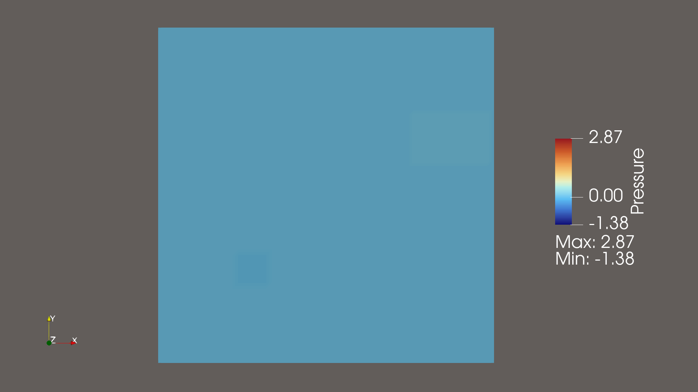
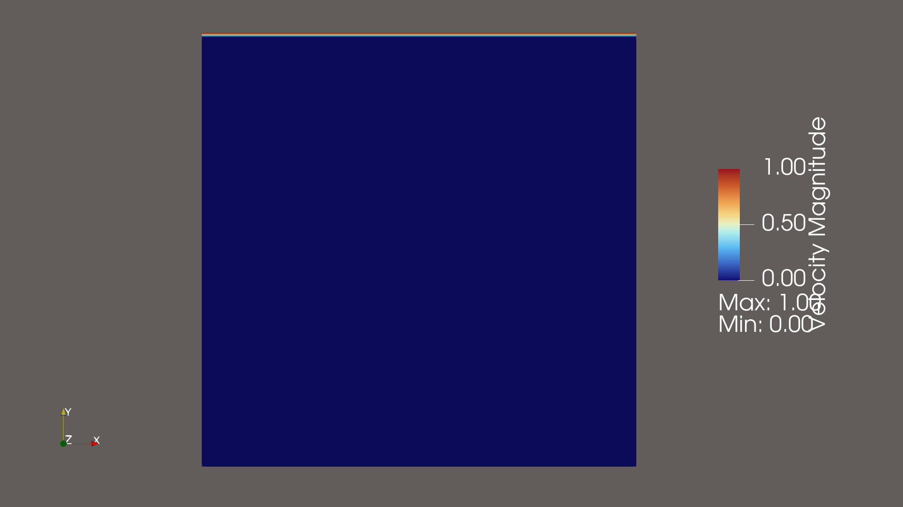
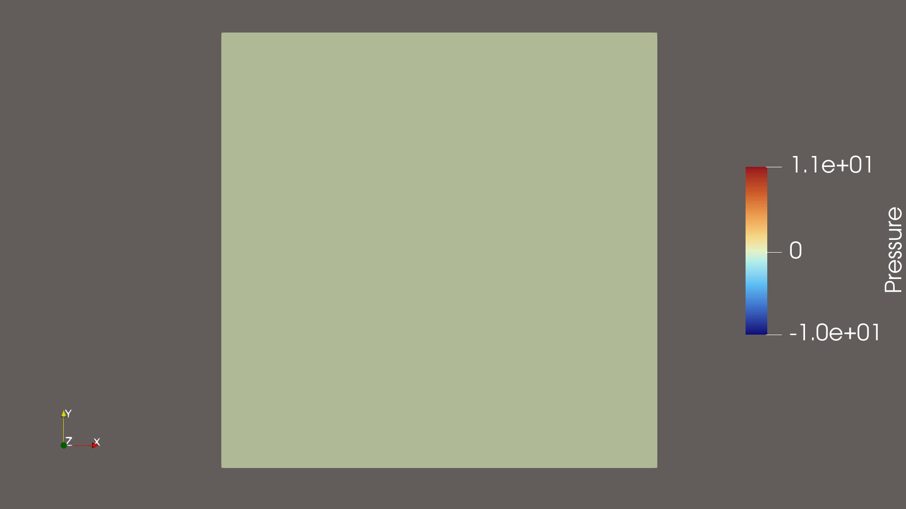
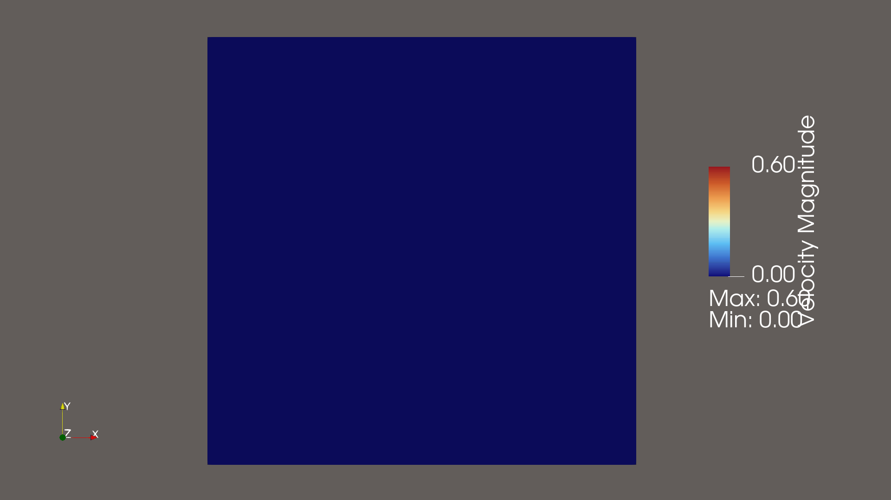

# CFD: 12 Steps to Navier-Stokes (Python)

A personal take on the classic **["12 Steps to Navier-Stokes"](https://github.com/barbagroup/CFDPython)** course by Prof. Lorena Barba, reworked as plain Python scripts instead of Jupyter notebooks. The course originally teaches CFD basics through 1D/2D finite-difference problems, working up to the 2D incompressible Navier-Stokes equations (cavity flow and channel flow).

The main difference from the original course: no notebooks and no matplotlib. Each step is a standalone `.py` script that computes the solution with NumPy (and SymPy where a symbolic derivative is needed), then exports the result as a VTK grid with `pyevtk` so it can be opened and animated in **ParaView**. This project is a way for me to learn both the CFD side and a more "production-style" workflow for handling numerical output, and it's still a work in progress — feedback is welcome.

## Contents

| Step | File | Topic |
|------|------|-------|
| 1  | `Step_01_linear_convection.py`        | 1D linear convection |
| 2  | `Step_02_nonlinear_convection.py`     | 1D nonlinear convection |
| 3  | `Step_03_diffusion_1D.py`             | 1D diffusion |
| 4  | `Step_04_Burgers_equation.py`         | 1D Burgers' equation |
| 5  | `Step_05_2D_linear_convection.py`     | 2D linear convection |
| 6  | `Step_06_2D_nonlinear_convection.py`  | 2D nonlinear convection |
| 7  | `Step_07_2D_diffusion.py`             | 2D diffusion |
| 8  | `Step_08_2D_Burgers_equation.py`      | 2D Burgers' equation |
| 9  | `Step_09_Laplace_equation.py`         | 2D Laplace equation |
| 10 | `Step_10_Poissons_equation.py`        | 2D Poisson equation |
| 11 | `Step_11_Navier_Stokes_cavity_flow.py`| 2D Navier-Stokes: cavity flow |
| 12 | `Step_12_Navier_Stokes_channel_flow.py`| 2D Navier-Stokes: channel flow |

## Preview

All results below were exported to VTK and viewed/animated in ParaView.

<table>
  <tr>
    <td align="center">
      <br>
      <sub>Step 10 — Poisson equation</sub>
    </td>
    <td align="center">
      <br>
      <sub>Step 11 — Cavity flow (velocity)</sub>
    </td>
  </tr>
  <tr>
    <td align="center">
      <br>
      <sub>Step 11 — Cavity flow (pressure)</sub>
    </td>
    <td align="center">
      <br>
      <sub>Step 12 — Channel flow</sub>
    </td>
  </tr>
</table>

## Requirements

- Python 3.8+
- [NumPy](https://numpy.org/)
- [SymPy](https://www.sympy.org/) — used for symbolic setup in some steps
- [pyevtk](https://github.com/pyscience-projects/pyevtk) — exports the solution grids to VTK
- [ParaView](https://www.paraview.org/) — to open and animate the exported `.vtr`/`.vtk` files

Install the Python dependencies with:

```bash
pip install numpy sympy pyevtk
```

## Usage

Each script is standalone. Run any step directly:

```bash
python Step_01_linear_convection.py
```

This will compute the solution and write the output as VTK files. Open them in ParaView to inspect the field (velocity magnitude, pressure, etc.) and build an animation over the timesteps. Feel free to tweak the grid resolution, time step, or boundary conditions inside each file to see how the numerical scheme behaves — that's where most of the learning happens (stability, numerical diffusion, the CFL condition, and so on).

## Background

This project follows Prof. Lorena Barba's open-source course, originally written for Jupyter notebooks with matplotlib for visualization:

- [CFD Python: 12 steps to Navier-Stokes](https://github.com/barbagroup/CFDPython)
- [Course announcement / blog post](https://lorenabarba.com/blog/cfd-python-12-steps-to-navier-stokes/)

It's a great practical introduction to computational fluid dynamics for anyone comfortable with Python and basic calculus/PDEs, with no prior CFD background required. This repo is my own exercise in reimplementing it outside of notebooks, using a VTK/ParaView workflow instead — I'm still learning, so structure and style will likely keep evolving.

## License

This project is intended for educational purposes. See individual file headers or the original course material for licensing details.
